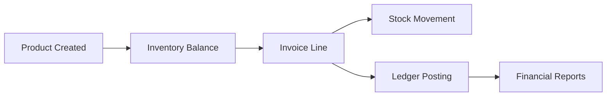
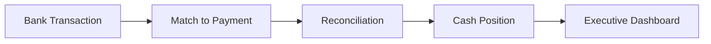
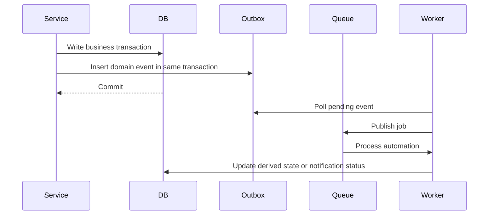

# Business Workflows

This document explains the main business workflows FinOS supports and the financial controls applied during each flow.

## Workflow 1: Customer to Credit Profile

```mermaid
flowchart LR
  Customer[Customer Created] --> Invoice[Invoice Created]
  Invoice --> Posted[Invoice Posted]
  Posted --> FollowUp[Collection Follow-Up]
  FollowUp --> Promise[Promise-To-Pay]
  Promise --> Payment[Payment Received]
  Payment --> Allocation[Payment Allocated]
  Allocation --> Reliability[Promise Reliability Updated]
  Reliability --> Credit[Credit Profile Refreshed]
```

### Description

1. A customer is created with contact and credit details.
2. An invoice is created and posted.
3. Posted receivables become visible in collections.
4. Collection teams create follow-ups for overdue or risky customers.
5. Customers may make promises to pay by a due date.
6. Payments are received and allocated to invoices.
7. Promise fulfillment is detected from allocations.
8. Credit profile and risk score are refreshed using payment and promise behavior.

### Controls

- Tenant-scoped customer, invoice, payment, and promise records
- Idempotency keys for duplicate-safe financial requests
- Transactional allocation and reversal logic
- Audit logs for financial operations
- Background promise breach detection

## Workflow 2: Product to Financial Posting

### Description

1. Products are configured with SKU, unit, purchase price, and sales price.
2. Inventory balances are maintained by product and location.
3. Sales invoices consume products through invoice lines.
4. Posting an invoice creates financial accounting entries.
5. Stock movements record quantity changes.
6. Financial views can derive revenue, receivables, profit, and inventory value.

### Controls

- Conditional stock updates prevent negative balances
- Stock movements preserve traceability
- Journal entries are balanced
- Reversals create compensating journal entries and stock movements
- Document numbers are generated with concurrency protection

## Workflow 3: Bank Transaction to Cash Position

### Description

1. A bank account is configured for a company.
2. Bank transactions are entered or imported.
3. Transactions are matched against payments or other financial records.
4. Reconciliation updates the operational cash picture.
5. Cash position feeds executive reporting and AI CFO explanations.

### Controls

- Bank records are tenant-scoped
- Reconciliation actions are auditable
- Payment reversal state is respected
- Cash position is derived from reliable financial records

## Event and Automation Flow

Events include invoice, payment, promise, risk score, and credit limit lifecycle changes. Automation handles reminders, breach detection, credit refreshes, dashboard refreshes, and notification dispatch.

## Financial Integrity Rules

- Posted financial documents are not silently deleted
- Reversals are explicit and traceable
- Journal entries remain balanced
- Payment allocations cannot exceed available payment or invoice balance
- Inventory balances cannot become negative
- Duplicate requests cannot create duplicate financial operations
- Background jobs must be idempotent and tenant-scoped
