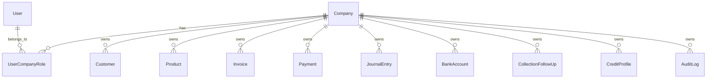
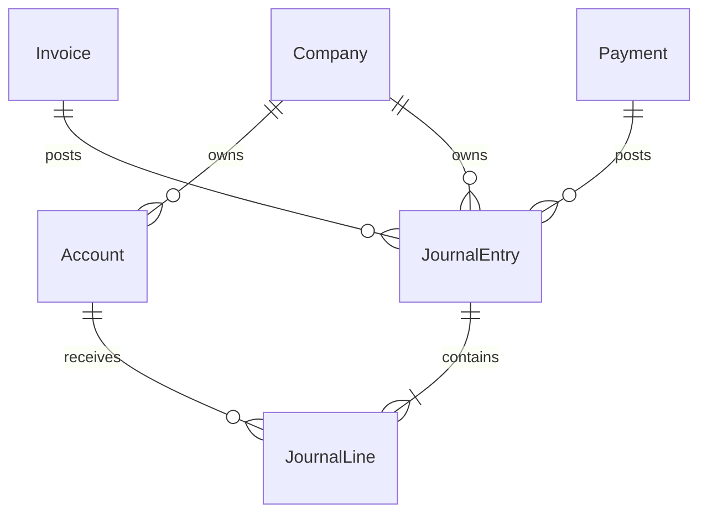
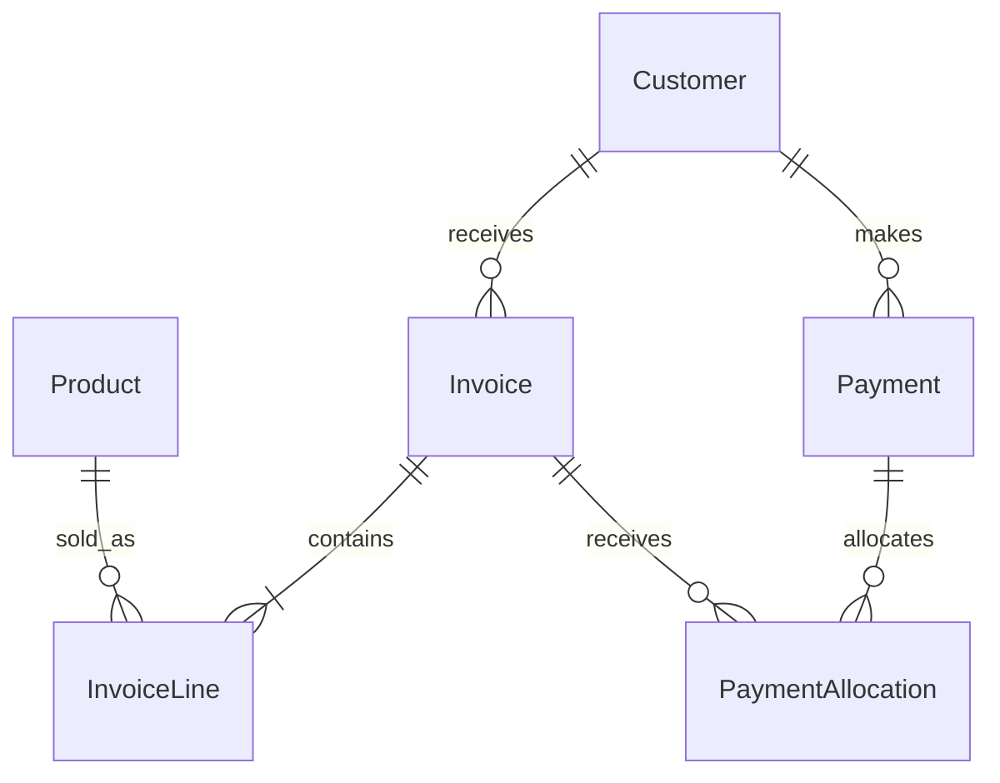
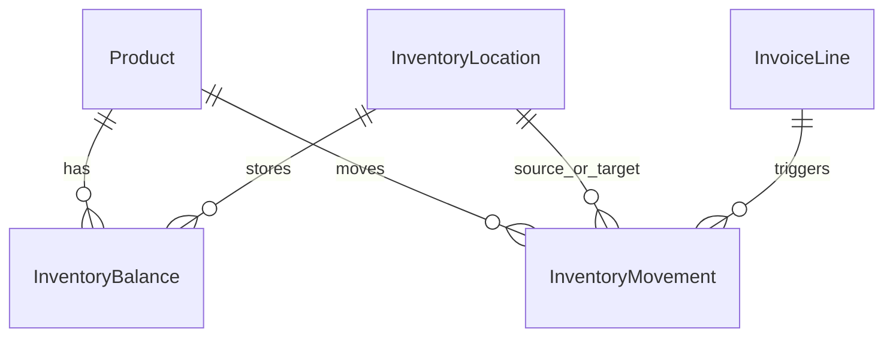
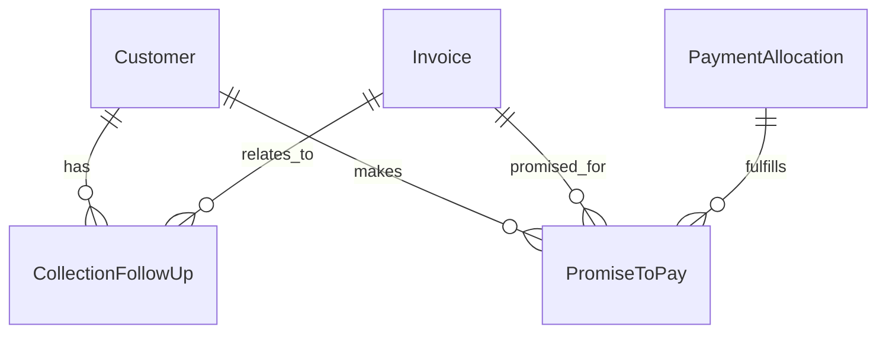
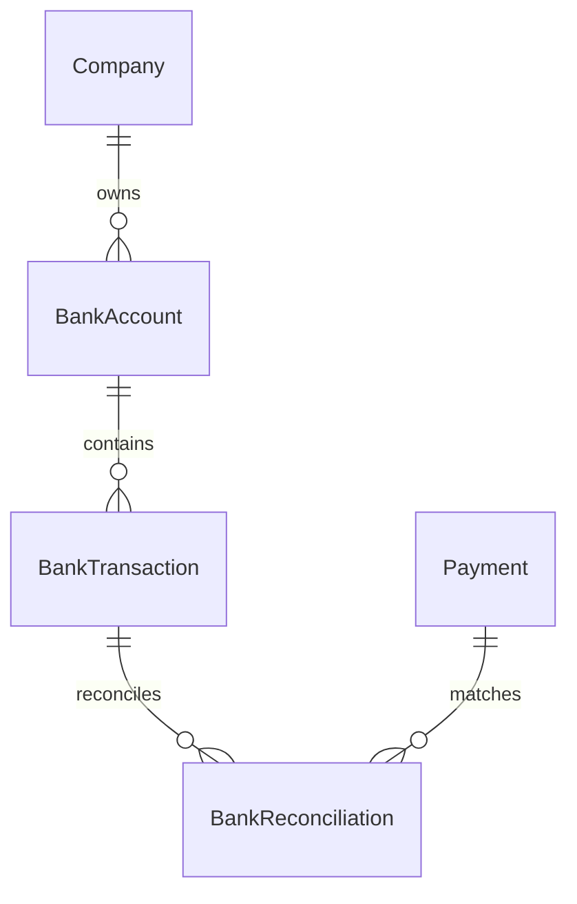
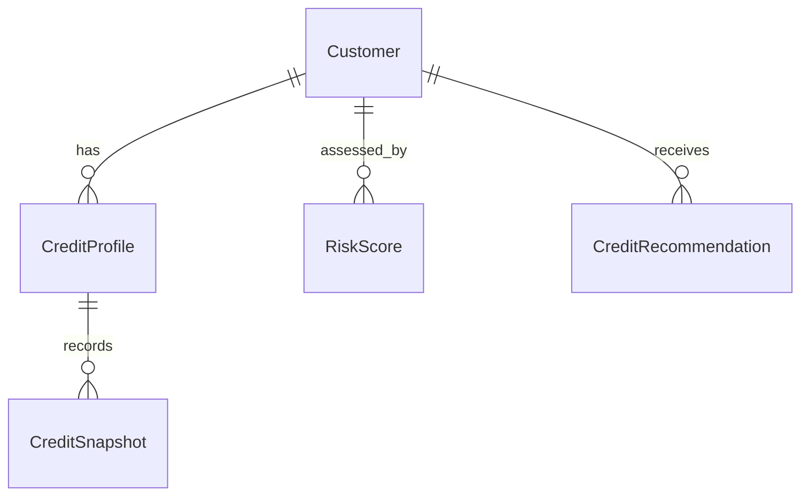
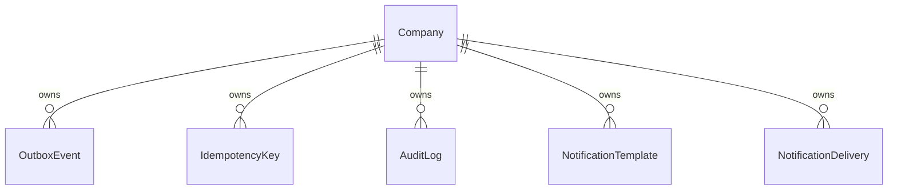

# Database Design

FinOS uses PostgreSQL as the financial system of record and Prisma as the typed data access layer. The schema is organized around tenant-owned business records, double-entry accounting, inventory movements, collections, banking reconciliation, credit intelligence, automation, and auditability.

## Design Principles

- Every tenant-owned entity is scoped by `companyId`
- Financial mutations are transactional
- Accounting uses journal entries and journal lines
- Inventory changes are represented as movements
- Payments and reversals preserve traceability
- Outbox events and idempotency keys support reliable distributed processing
- Audit logs capture sensitive and financial activity

## Core Entity Map

## Multi-Tenancy Model

`Company` is the tenant boundary. Users gain access through company role membership. Business queries include the active `companyId`, which prevents cross-company data access.

Core tenant-scoped entities include:

- Customers
- Products
- Inventory locations, balances, and movements
- Invoices and invoice lines
- Payments and allocations
- Bank accounts and bank transactions
- Journal entries and journal lines
- Collection follow-ups
- Promises to pay
- Credit profiles and risk records
- Notification templates and deliveries
- Audit logs
- Outbox events
- Idempotency keys

## Accounting Model

FinOS uses a double-entry accounting model.

Important accounting rules:

- Posted financial documents create journal entries
- Journal entries contain balanced debit and credit lines
- Reversals create reversing journal entries instead of mutating history destructively
- Payment allocations affect receivable balances through controlled transactions

## Sales and Payments Model

Sales and payment records preserve:

- Invoice lifecycle state
- Payment lifecycle state
- Allocation history
- Reversal linkage
- Document numbers
- Tenant and audit context

## Inventory Model

Inventory is managed through balances and stock movements. Sales can create stock decrements. Reversals create compensating stock movements where applicable.

Key invariants:

- Stock balances cannot go negative
- Movements are traceable to business source documents
- Inventory updates are tenant-scoped and transactionally protected

## Collections Model

Collections includes:

- Follow-up records
- Promise-to-pay lifecycle
- Automatic fulfillment detection
- Breach detection
- Promise reliability metrics
- Collection dashboard aggregates

## Banking Model

Banking supports:

- Bank accounts
- Imported or entered bank transactions
- Reconciliation status
- Cash position visibility
- Links between banking movements and payments

## Credit Intelligence Model

Credit intelligence uses existing operational data to compute:

- Outstanding exposure
- Payment reliability
- Promise reliability
- Credit utilization
- Risk score
- Credit command center aggregates

## Reliability and Audit Entities

`OutboxEvent` enables atomic event persistence. `IdempotencyKey` prevents duplicate financial operations. `AuditLog` records sensitive activity. Notification records preserve delivery status and retry metadata.
