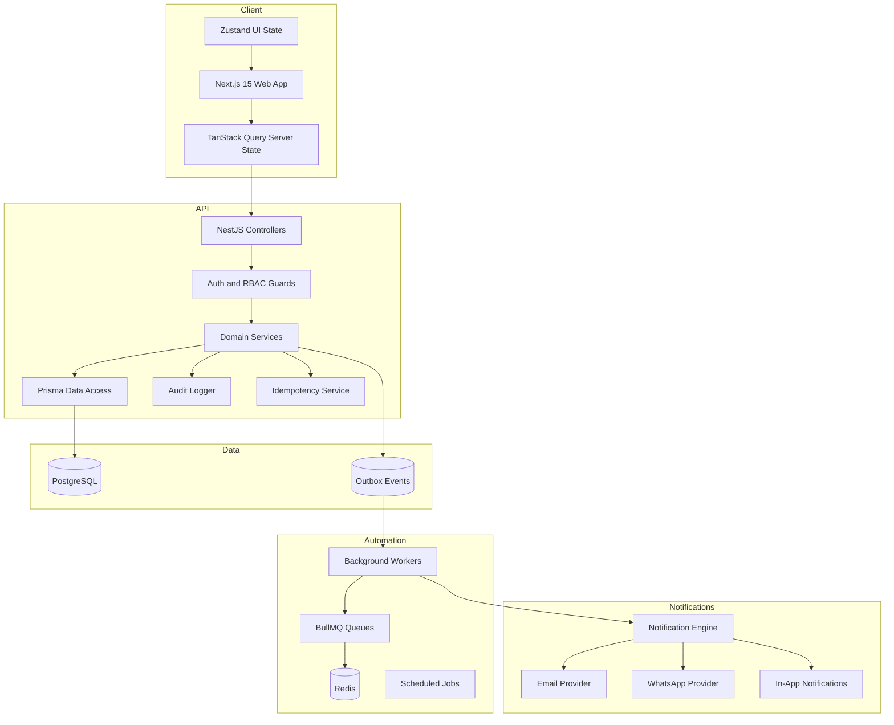
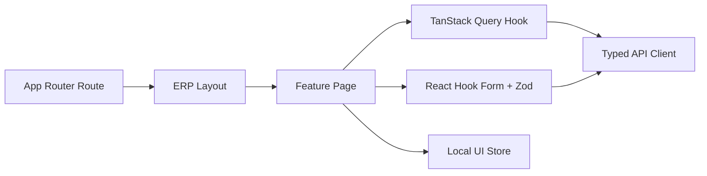
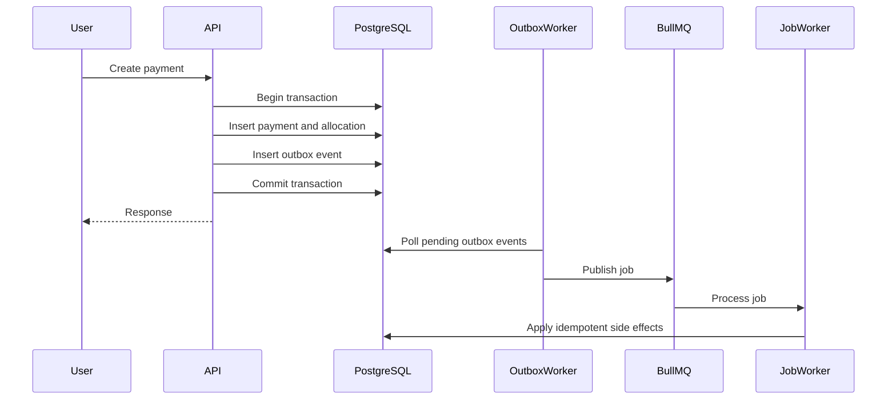
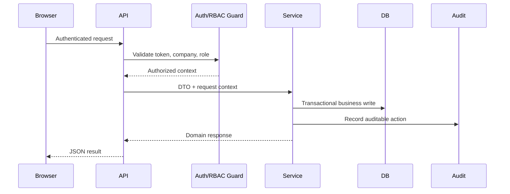

# System Architecture

FinOS is a modular SaaS platform for SME finance operations. The architecture separates product experience, business APIs, persistent financial state, background automation, and notification delivery while keeping tenant isolation and financial consistency at the center.

## High-Level Architecture

## Frontend

The frontend is a production-oriented ERP interface built with:

- Next.js 15 and TypeScript
- Tailwind CSS
- shadcn/ui-style primitives
- TanStack Query for server state
- Zustand for local UI state
- React Hook Form and Zod for validated forms

The UI is desktop-first, information-dense, and designed around repeated finance workflows rather than marketing pages.

## Backend

The backend is a NestJS API organized by business capability:

- Auth
- RBAC
- Companies
- Customers
- Products
- Inventory
- Sales
- Payments
- Accounting
- Banking
- Collections
- Credit Intelligence
- Event Infrastructure
- Automation
- Notifications
- AI CFO

Controllers expose HTTP APIs. Services hold business rules. Prisma owns database access. Guards enforce authentication, tenant access, and role permissions.

## Infrastructure

FinOS uses PostgreSQL as the system of record. Redis and BullMQ power asynchronous processing. A transactional outbox prevents lost events when database writes and queue publication must happen reliably.

## Architecture Patterns

### Multi-Tenancy

Every tenant-owned business record is scoped by `companyId`. API access is resolved through authenticated company membership and enforced at service and query boundaries.

### RBAC

Role-based access control protects operational areas such as sales, inventory, payments, banking, collections, credit, and administration.

### Event-Driven Design

Business services write domain events to the outbox inside the same database transaction as the source operation. Workers publish those events to queues for asynchronous automation.

### Idempotency

Financial mutation APIs accept idempotency keys. A repeated request with the same key and same payload returns the original response. A repeated key with a different payload is rejected.

### Concurrency Protection

Critical financial paths use transactions, conditional updates, row-level safety patterns, and invariant checks to prevent over-allocation, duplicate reversals, negative stock, and duplicate document numbers.

### Auditability

Security-sensitive and financial operations write audit records with user, company, action, entity, and metadata context.

## Request Lifecycle

## Background Job Model

Scheduled jobs and event-triggered jobs run through BullMQ. Job handlers are designed to be retry-safe and tenant-scoped.

Key job categories:

- Credit profile refresh
- Risk score refresh
- Promise breach detection
- Collection dashboard refresh
- Notification dispatch
- Outbox event publication

## Observability

Logs include operational identifiers where available:

- `requestId`
- `jobId`
- `correlationId`
- `companyId`
- `userId`

These fields make it easier to trace a financial operation from API request to outbox event to background job.
