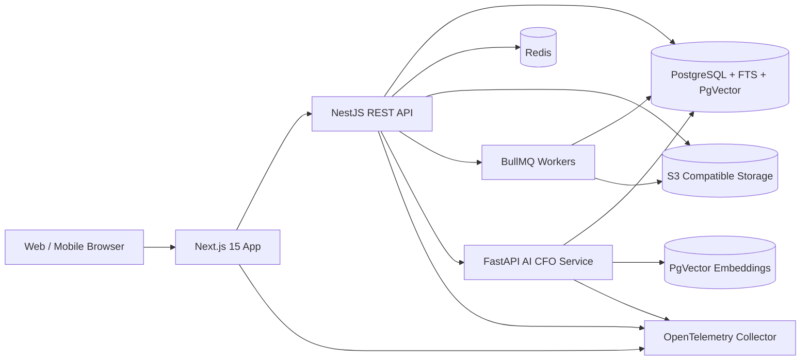

# FinOS Architecture and Implementation Plan

FinOS is a multi-tenant financial operating system for SMEs. The product is built as a modular SaaS platform with strict tenant isolation, double-entry accounting as the source of financial truth, inventory ledgers as the source of stock truth, and AI insights grounded only in tenant-scoped business data.

## 1. Product Principles

- Enterprise ERP workflow over marketing-style UI.
- Dense, searchable, keyboard-friendly tables for daily operations.
- No predefined industry catalog. Customers define products, categories, units, and dynamic attributes.
- Every persisted business record is company scoped.
- Every financial transaction posts balanced ledger entries.
- Every inventory-changing transaction posts stock ledger entries.
- Every mutation is validated, authorized, audited, and rate limited.
- AI responses must cite/query tenant data and return uncertainty when evidence is insufficient.

## 2. System Architecture



## 3. Monorepo Layout

```text
apps/
  web/                 Next.js 15 ERP UI
  api/                 NestJS REST API
  ai/                  FastAPI + LangGraph AI CFO
  worker/              BullMQ background processors
packages/
  database/            Prisma schema, migrations, seed helpers
  config/              Shared environment validation
  contracts/           Shared API DTO and domain types
  ui/                  Shared shadcn/ui components
  eslint-config/       Shared lint rules
  tsconfig/            Shared TypeScript config
docs/
  architecture-and-implementation-plan.md
  api-specification.md
  deployment-guide.md
infra/
  docker/
  otel/
```

## 4. Bounded Contexts

- Identity: users, sessions, refresh tokens, email verification, password reset, RBAC.
- Tenant: companies, memberships, company settings, financial year, currency.
- Parties: customers, suppliers, contacts, addresses.
- Product Catalog: categories, subcategories, units, tax rates, products, user-defined product attributes.
- Inventory: stock locations, stock balances, stock movements, adjustments, transfers.
- Sales: quotations, sales orders, invoices, invoice lines, tax and discount calculations.
- Purchases: purchase orders, supplier bills, supplier invoice lines, goods receipt behavior.
- Accounting: chart of accounts, journal entries, ledger lines, fiscal periods, reports.
- Payments: receipts, supplier payments, allocations, installments.
- Collections: aging buckets, follow-up queue, expected collections.
- Credit Intelligence: credit exposure, customer risk scoring, collection prediction, recommended credit limits, expected payment dates, and AI-driven cashflow forecasts.
- Cashflow: actual and forecast cash movement.
- Analytics: revenue, product, party, supplier, financial dashboards.
- AI CFO: tenant-scoped RAG queries, insight generation, credit explanation, and decision support.
- Audit: immutable change history.
- Reporting: CSV, Excel, PDF exports.

## 5. Multi-Tenancy Model

All tenant-owned tables contain `companyId`. Application access uses a request-scoped tenant context resolved from the authenticated membership. All read/write repositories require `companyId`; service methods never accept unscoped queries.

Isolation layers:

- API guard validates JWT and active company membership.
- RBAC guard checks role permissions per module/action.
- Prisma service helpers inject company filters for tenant-owned models.
- Database indexes include `companyId` for high-cardinality tenant queries.
- Audit logs include `companyId`, `actorUserId`, IP, user agent, before/after JSON.

## 6. Roles and Permissions

Roles:

- Owner: full access, billing/settings/users.
- Manager: operational and reporting access except destructive company settings.
- Accountant: invoices, purchases, payments, ledger, reports.
- Sales Executive: customers, quotations, sales orders, invoices, collections assigned.
- Inventory Manager: products, stock locations, stock movements, purchase receiving.

Permissions are modeled as module/action strings such as `sales.invoice.create`, `accounting.report.read`, and `inventory.adjustment.approve`.

## 7. Database Architecture

PostgreSQL stores transactional data. Prisma is the ORM. JSONB is used only where the shape is intentionally user-defined, especially product dynamic attributes and audit snapshots.

Core consistency rules:

- Money values use `Decimal(18, 4)`.
- Ledger entries are immutable after posting. Corrections use reversing entries.
- Journal entries must balance: total debit equals total credit.
- Stock ledger is append-only. Current stock is materialized in stock balance rows.
- Credit intelligence outputs are append-oriented and versioned where model output is involved.
- Approved credit limits are user decisions, while recommended credit limits are system recommendations.
- External document numbers are company scoped and unique per document type.
- Soft delete is limited to master data. Financial and stock transactions are voided or reversed.

Credit Intelligence schema groups:

- `CreditPolicy`: tenant credit rules, approval thresholds, hold behavior, and recommendation expiry.
- `CreditProfile`: current customer exposure, approved limit, utilization, risk score, and credit hold state.
- `CustomerRiskSnapshot`: historical score timeline and score drivers.
- `CreditLimitRecommendation`: model version, feature snapshot, recommended limit, confidence, reasons, status, and decision metadata.
- `CollectionPrediction`: invoice-level probability, expected payment date, expected amount, forecast scenario, and recommended action.
- `CreditCashflowForecastRun` and `CreditCashflowForecastLine`: probability-weighted forecast scenarios with source traceability.

## 8. API Architecture

REST is the primary interface. API routes are versioned under `/v1`.

Common patterns:

- `GET /v1/{resource}` supports search, advanced filters, sort, cursor pagination, and bulk selection metadata.
- `POST /v1/{resource}` creates validated records.
- `PATCH /v1/{resource}/{id}` updates mutable fields.
- `POST /v1/{resource}/{id}/void` voids immutable transaction documents.
- `POST /v1/{resource}/bulk` executes validated bulk actions.

Credit Intelligence API surface:

- `GET /v1/credit-intelligence/overview`: credit exposure, overdue exposure, risk distribution, collection forecast, and cashflow forecast summary.
- `GET /v1/credit-intelligence/customers`: customer credit profiles with risk score, utilization, outstanding, overdue amount, predicted collection value, and recommended limit status.
- `GET /v1/credit-intelligence/customers/{partyId}`: full customer credit dossier with score timeline, payment behavior, predictions, recommendations, and explanations.
- `POST /v1/credit-intelligence/customers/{partyId}/score`: recompute a customer risk score.
- `GET /v1/credit-intelligence/recommendations`: pending, approved, rejected, overridden, and expired credit-limit recommendations.
- `POST /v1/credit-intelligence/recommendations/{id}/approve`: approve a recommended credit limit and update the customer credit profile.
- `POST /v1/credit-intelligence/recommendations/{id}/reject`: reject a recommendation with a required reason.
- `POST /v1/credit-intelligence/recommendations/{id}/override`: approve a manual limit with a required reason and audit entry.
- `GET /v1/credit-intelligence/collection-predictions`: invoice-level collection probability, expected payment date, expected amount, and recommended action.
- `POST /v1/credit-intelligence/collection-predictions/refresh`: refresh predictions for selected invoices or all open receivables.
- `GET /v1/credit-intelligence/cashflow-forecasts`: conservative, expected, and optimistic forecast runs.
- `POST /v1/credit-intelligence/cashflow-forecasts`: generate a new probability-weighted forecast run.

Errors use a standard envelope:

```json
{
  "error": {
    "code": "VALIDATION_ERROR",
    "message": "One or more fields are invalid.",
    "details": []
  },
  "requestId": "req_..."
}
```

## 9. Frontend Architecture

The web app is desktop-first and mobile usable:

- App Router with route groups by module.
- React Query for server state.
- Zustand for workspace preferences, active company, command palette, and table state.
- React Hook Form + Zod for forms.
- shadcn/ui primitives customized for dense ERP layouts.
- Global search and command palette.
- Table views support filters, saved views, bulk actions, column visibility, export, keyboard navigation.

Primary navigation:

- Dashboard
- Sales
- Purchases
- Customers
- Suppliers
- Products
- Inventory
- Banking & Payments
- Credit Intelligence
- Accounting
- Collections
- Reports
- AI CFO
- Settings

## 10. Backend Architecture

NestJS modules map to bounded contexts. Each module has controllers, services, DTOs, policies, and repositories. Cross-cutting modules provide auth, tenant context, audit logging, rate limiting, OpenTelemetry, file storage, queues, and database access.

Important services:

- LedgerPostingService: posts balanced journal entries from sales, purchases, payments, adjustments.
- InventoryPostingService: posts stock ledger entries and updates balances atomically.
- PaymentAllocationService: auto-allocates receipts/payments by due date and remaining balance.
- AgingService: computes party aging from open invoices/bills.
- CashflowService: combines actual payments, open receivables/payables, and forecast assumptions.
- CreditIntelligenceService: orchestrates risk scoring, exposure analysis, collection probability, expected payment date prediction, credit-limit recommendations, and credit policy exceptions.
- RiskScoringService: scores customers from payment delays, outstanding balance, exposure utilization, order frequency, collection behavior, and historical disputes.
- CollectionPredictionService: predicts invoice-level collection probability, expected payment date, expected delay, and recommended follow-up action.
- CreditLimitRecommendationService: recommends customer credit limits with explainable drivers and approval workflow.

## 11. Credit Intelligence Engine

Credit Intelligence is a first-class FinOS module for credit-based SMEs. It is not a passive AI chat feature; it produces operational decisions used by sales, collections, accounting, and cashflow planning.

Core capabilities:

- Customer credit profile: current credit limit, exposure, utilization, overdue exposure, payment behavior, dispute history, and risk level.
- Risk scoring: Low, Medium, High risk with numeric score, explainable drivers, and trend versus previous score.
- Recommended credit limits: model-generated recommended limit, confidence, reasons, required approvals, and expiration.
- Collection prediction: invoice-level collection probability, expected payment date, expected delay days, forecast amount, and recommended action.
- AI-driven cashflow forecasting: daily, weekly, and monthly forecasts using open receivables, open payables, payment history, seasonality, promised payments, and collection probabilities.
- Policy controls: company-defined credit rules such as max exposure by role, auto-hold thresholds, required approval levels, and stale recommendation expiry.
- Decision auditability: every recommendation stores model version, feature inputs, explanation, confidence, actor decision, and final outcome.

Credit Intelligence data sources:

- Sales invoices, due dates, payment allocations, partial payments, write-offs, and credit notes.
- Customer outstanding balances, credit limits, order frequency, average days to pay, and overdue aging.
- Collection follow-ups, promised payment dates, call outcomes, disputes, and broken promises.
- Purchase/payable schedules for net cashflow forecasting.
- Ledger cash and bank account movements.

Operational surfaces:

- Credit command center with exposure, top risky customers, high-value overdue invoices, and forecasted collections.
- Customer credit tab with risk score timeline, recommended limit, exposure utilization, payment behavior, and open predictions.
- Invoice collection workbench sorted by probability-adjusted expected collection value.
- Sales order credit check before approval or dispatch.
- Cashflow forecast view with conservative, expected, and optimistic scenarios.

The engine must never silently change a customer's approved credit limit. It creates recommendations; authorized users approve, reject, or override them with a reason. Approved decisions are audited and update the customer credit profile.

## 12. AI CFO Architecture

AI CFO is a separate FastAPI service using LangGraph for controlled tool execution:

- API receives authenticated, tenant-scoped question request from NestJS.
- Intent classifier maps question to approved tools.
- Tools execute read-only SQL/report queries with mandatory `company_id`.
- RAG retrieves tenant documents, invoice notes, report summaries, and embeddings from PgVector.
- Credit tools query Credit Intelligence outputs for risk explanations, expected payment dates, collection probability, and forecast drivers.
- Answer generator produces a grounded answer with cited metrics and confidence.
- If evidence is insufficient, the assistant says what data is missing.

The AI service never accesses unrestricted database credentials. It uses a read-only DB role and parameterized queries.

## 13. Security

- Argon2id password hashing.
- Short-lived JWT access tokens.
- Rotating refresh tokens stored hashed with device/session metadata.
- Email verification and password reset tokens stored hashed with expiry.
- RBAC guards on every controller.
- Tenant guard on every company-scoped route.
- Zod/class-validator DTO validation.
- Prisma parameterization prevents SQL injection for ORM queries.
- Raw SQL is centralized and parameterized.
- Rate limiting by IP, user, route, and tenant.
- Security headers in web and API.
- S3 uploads use presigned URLs and tenant-prefixed object keys.
- Audit trails for create/update/delete/void/post/login/security events.
- Credit recommendations and overrides require explicit permissions and store reason codes.

## 14. Background Jobs

BullMQ queues:

- email: verification, reset, invoice send, collection reminders.
- reports: CSV, Excel, PDF generation.
- accounting: scheduled period close checks and ledger recalculation verification.
- analytics: daily aggregates.
- ai: embedding refresh and business insight summaries.
- cashflow: forecast refresh.
- credit-intelligence: nightly risk scoring, collection prediction refresh, credit-limit recommendations, and probability-weighted cashflow forecasts.

## 15. Testing Strategy

- Unit tests for domain services and validators.
- Integration tests for API modules using PostgreSQL test containers where available.
- Contract tests for shared API DTOs.
- E2E tests with Playwright for critical flows: signup, company setup, customer/product creation, invoice, payment, ledger report.
- Accounting invariants: journal entries always balance.
- Inventory invariants: stock balances match ledger movements.
- Tenant isolation tests: data from Company A is never visible to Company B.
- Credit intelligence invariants: recommendations are tenant scoped, explainable, versioned, never auto-approved, and forecast totals reconcile to source receivables/payables.

## 16. Deployment Architecture

Production services:

- `web`: Next.js standalone server.
- `api`: NestJS API.
- `worker`: BullMQ worker.
- `ai`: FastAPI service.
- `postgres`: managed PostgreSQL with PgVector.
- `redis`: managed Redis.
- `s3`: S3 compatible object storage.
- `otel-collector`: metrics/tracing/log export.

Docker Compose supports local development with Postgres, Redis, MinIO, API, web, AI, and worker.

## 17. Implementation Sequence

1. Monorepo foundation: package manager, TypeScript configs, linting, Docker, environment contracts.
2. Database schema: complete Prisma domain model with tenant-aware tables, indexes, relations, and seed roles.
3. API foundation: NestJS app, auth, tenant context, RBAC, Prisma, audit, OpenTelemetry, error envelope.
4. Identity and company management.
5. Master data: customers, suppliers, products, categories, dynamic attributes, tax rates, units.
6. Inventory ledger: locations, balances, movements, adjustments, transfers.
7. Sales and purchases documents.
8. Ledger engine and accounting reports.
9. Payments, allocations, aging, collections.
10. Credit Intelligence: credit profiles, scoring runs, collection predictions, recommended limits, approval workflow, and probability-weighted forecasts.
11. Cashflow, analytics, exports.
12. Web ERP shell, tables, forms, command palette, module screens.
13. AI CFO service and tenant-scoped RAG with Credit Intelligence tools.
14. Full test suite, CI/CD, hardening, production deployment guide.

## 18. Definition of Done

- No tenant-owned model can be accessed without `companyId`.
- Authenticated routes are protected by auth, tenant, and permission policies.
- Every transaction mutation is audited.
- Sales/purchase/payment flows post accounting entries.
- Inventory flows post stock entries.
- Credit Intelligence recommendations are explainable, versioned, permissioned, and never mutate approved credit limits without user approval.
- Reports derive from ledger or stock ledger, not ad hoc inconsistent totals.
- CI runs typecheck, lint, unit tests, API tests, and Playwright smoke tests.
- Docker local stack starts from a clean checkout.
